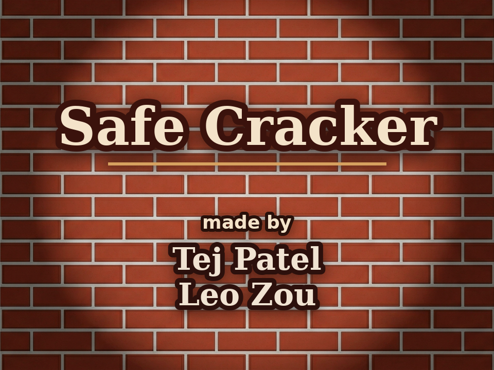
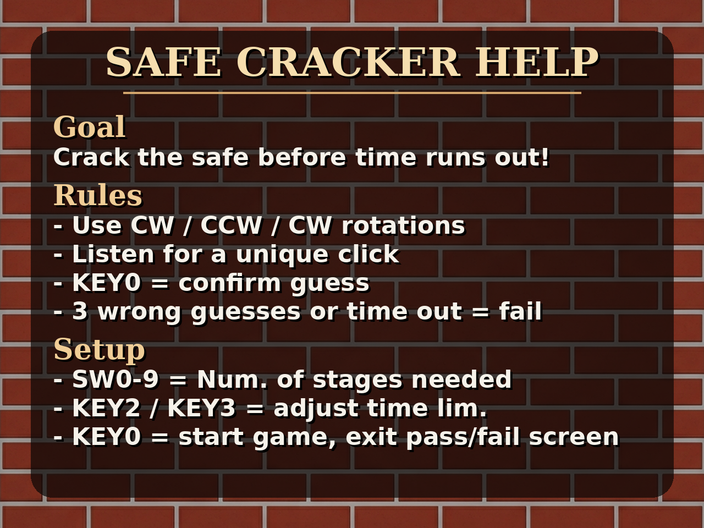
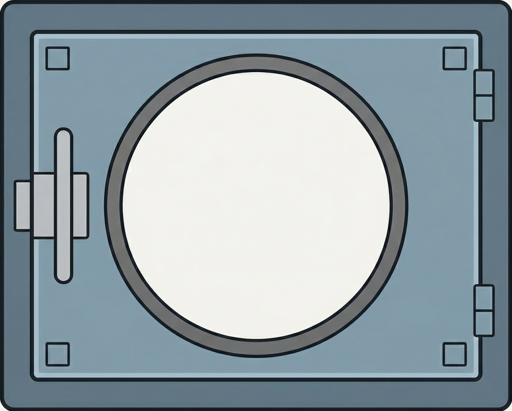
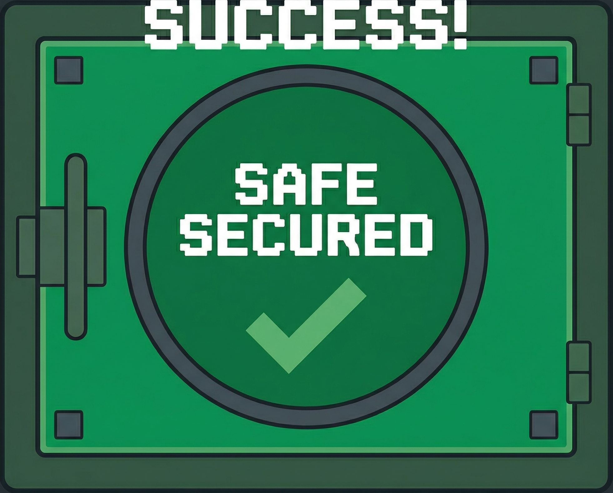
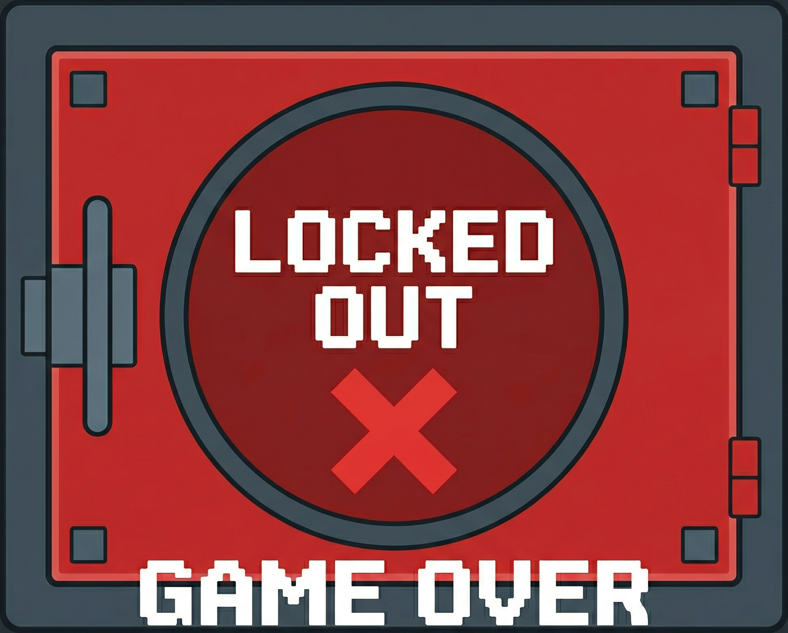
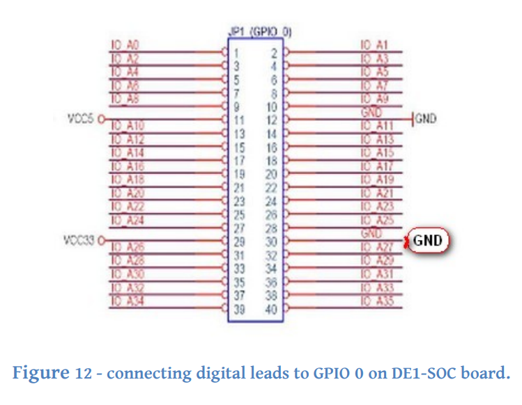
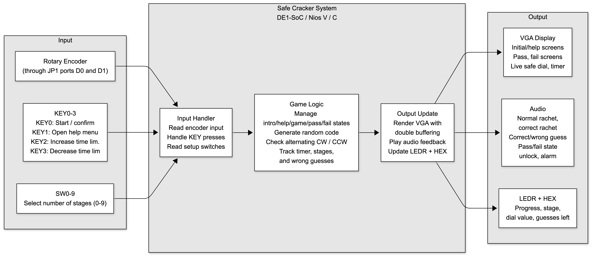

# Safe Cracker

## Rotary-Encoder Safe Cracking Game (DE1-SoC / Nios V)

A safe cracking game written in C for the DE1-SoC. A real rotary encoder, mounted in a
3D-printed case and wired into the board's JP1 header, turns a safe dial drawn on a 320x240
VGA display. The player spins the dial to find a random combination, using audio cues and
alternating the turn direction like a real lock, before the timer runs out.

The game runs on a Nios V processor with no operating system. Interrupt handling, the
graphics, the math for the dial, and the audio playback are all written from scratch.

By: **Tej Patel** & **Leo Zou**

---

## Demo

**Video:** [Google Drive](https://drive.google.com/file/d/1jstQclyEpFpwkT6OPigZCI7hnV77oXO9/view?usp=drive_link)

**Project pictures (hardware, enclosure, board setup):** [Google Drive Folder](https://drive.google.com/drive/folders/1qsyP7JgdmJ4kz1QdTN5XOlyEALHF50tc?usp=drive_link)

| Start screen | Help screen |
| --- | --- |
|  |  |

| Safe (gameplay) | Safe (unlocked) | Safe (failed) |
| --- | --- | --- |
|  |  |  |

---

## Repository Structure

* `docs/` — final report, project plan, block diagram, JP1 pinout, and the
  enclosure model (`243 SafeCracker.3mf`).
* `image-assets/` — source `.png` art, the exported RGB565 `.c` arrays, and the image
  conversion script.
* `audio-assets/` — source `.mp3` sound effects that were converted into PCM sample arrays.

> **Academic Integrity & Licensing**
> To comply with the University of Toronto's academic integrity policy, the C source code
> for this course project is **not** published in this repository. 

---

## Hardware

| Component | Detail |
| --- | --- |
| Board | Intel DE1-SoC (Cyclone V) |
| Processor | Nios V  |
| Input | Rotary encoder on JP1 (GPIO 0), KEY0–3, SW0–9 |
| Output | VGA 320x240 @ 16-bit RGB565, audio codec, HEX0–5, LEDR0–9 |
| Enclosure | Custom rotary-encoder and wiring housing, modelled in Tinkercad and 3D printed |
| Debounce | 10 µF ceramic capacitors on the encoder's CLK and DT lines |

### Rotary encoder wiring

The encoder's DT and CLK pins are wired into the JP1 expansion header (D0 and D1) along with
3.3 V and ground. D0 triggers an interrupt on every edge, and D1 is read inside the handler
to work out which way the dial turned.

### Enclosure

The encoder module on its own is too small to spin like a safe dial, and the jumper wires
come loose when you keep turning it. I modelled a case in Tinkercad and 3D printed it to
hold the encoder in place, route the wires out the back, and give the whole thing a stable
base to sit on. The model is at
[`docs/243 SafeCracker.3mf`](docs/243%20SafeCracker.3mf).

---

## Gameplay

The safe hides a random combination, with each number between 0 and 39. The player has to
enter every number in order, and like a real lock, the turn direction alternates each stage:
clockwise, counterclockwise, clockwise, and so on. Landing on the right number while turning
the wrong way still counts as wrong.

Two things help the player. A different click sound plays when the dial reaches the correct
number for the current stage, and the HEX displays and LEDs show progress as they go. The
player gets **3 wrong guesses** and a time limit they choose before starting. Running out of
either ends the game with an alarm. Entering the full combination opens the safe.

### Controls

**Setup (intro / help screens)**

| Input | Action |
| --- | --- |
| `SW0–9` | Number of stages in the combination — 1 minimum, 10 maximum, each switch adds one |
| `KEY3` / `KEY2` | Decrease / increase the time limit in 10 s steps (7 s to 670 s) |
| `KEY1` | Toggle the help screen |
| `KEY0` | Confirm settings and start |
| `HEX0–1` | Selected number of stages |

**Gameplay**

| Input / Output | Action |
| --- | --- |
| Rotary encoder | Spin the dial — two full physical revolutions cover the on-screen 0–39 |
| `KEY0` | Confirm the current guess; also exits the pass and fail screens |
| `HEX0–1` | Current dial position (0–39) |
| `HEX2–3` | Current stage |
| `HEX4–5` | Guesses remaining |
| `LEDR0–9` | Stage progress |
| VGA | Live dial, safe art, and a 3-digit countdown |

---

## System Architecture

The program is one main loop that draws frames, plays audio, and updates the HEX displays
and LEDs. It never checks the inputs itself. All input is handled by three interrupts that
update the game state, and the main loop just shows whatever that state is.

### 1. Interrupts

One handler reads the `mcause` register to find out which interrupt fired, then calls the
matching routine. The control registers (`mstatus`, `mtvec`, `mie`) are set up with inline
assembly.

| IRQ | Source | What it does |
| --- | --- | --- |
| 27 | JP1 parallel port | Rotary encoder edges — debounce, find direction, update dial position |
| 18 | KEY0–3 | Screen changes, confirming a guess, adjusting the time limit |
| 16 | FPGA interval timer | Counts the timer down once per second, and fails the game at zero |

The interval timer is loaded with the 100 MHz clock rate, so it interrupts exactly once per
second.

### 2. Reading the rotary encoder

Mechanical encoders bounce. One click of the dial produced many false edges, which made the
on-screen dial jump around. Three things fixed it:

* **Hardware.** A 10 µF ceramic capacitor on each of the CLK and DT lines. Together with the
  encoder's pull-up resistors this forms an RC filter that smooths out most of the bounce
  before the signal reaches the board.
* **Software debounce.** Every accepted edge records the value of the RISC-V machine timer.
  Any edge that arrives less than 180,000 ticks later is ignored.
* **Edge counting.** The encoder gives two edges per click of the dial, so the handler only
  moves the dial on every second edge.

Direction comes from comparing CLK and DT when the interrupt fires. If they are different,
the dial is turning clockwise. If they are the same, counterclockwise. The dial position
wraps around at 0 and 39, and the direction is saved so the game can check it when the
player confirms a guess.

### 3. Game logic

The game state is a set of `volatile` globals shared between the interrupt handlers and the
main loop: dial position, the combination, the current stage, the last turn direction, the
number of wrong guesses, and which screen is showing. A new combination is generated with
`rand()` at the start of each game, seeded from the machine timer so it is different every
time.

When the player presses `KEY0`, the game checks both the number and the turn direction
against what the current stage expects (`stage % 2` picks clockwise or counterclockwise). A
correct guess moves to the next stage, or opens the safe if it was the last one. A wrong
guess resets progress back to the first number and costs one of the three attempts. The
combination itself stays the same, so the player can still finish the game.

The screen is tracked as one of five states (`INTRO`, `HELP`, `GAME`, `PASS`, `FAIL`). Both
the drawing code and the input handlers switch on it, which keeps the graphics separate from
the game logic.

### 4. Graphics

All of the graphics are built on one function that writes a single pixel.

* **Double buffering.** Two 240x512 buffers are stored in memory. The full frame is drawn
  into the back buffer and swapped on vertical sync, so the dial does not flicker while
  turning. The 512-pixel width means a pixel address is just `base + (y << 10) + (x << 1)`,
  with no multiplication.
* **Lines and circles.** Lines use Bresenham's algorithm. Circle outlines use the midpoint
  circle algorithm, which draws one eighth of the circle and mirrors it around. Filled
  circles check `x² + y² <= r²` over a square area, so there are no square roots.
* **Fixed-point math.** There is no floating point hardware, so sine and cosine are 40-entry
  integer tables with every value multiplied by 1024. Angles are stored in tenths of a
  degree, which puts each of the 40 dial positions exactly 90 units apart. Results are
  divided by 1024 after use.
* **The dial.** All 40 tick marks are redrawn every frame at the current angle: longer marks
  with a number every 5 positions, shorter marks in between, then the dial face, the centre
  knob, and a red pointer on top.
* **Digits.** Numbers are drawn from a 3x5 bitmap font stored as hex values, where `0x7` is
  three pixels on in a row. The same function draws the small dial numbers and the large
  3-digit timer, just at a different scale.
* **Skipping the screen clear.** The gameplay screen does not clear to black first, because
  the brick wall image already covers every pixel. That saves a full pass over the frame
  every time.
* **Transparency.** The pass and fail emojis are saved on a magenta background (`0xF81F`).
  The drawing function skips that colour, so they sit on top of the wall without a box
  around them.

### 5. Audio

Six sound effects are stored in memory as sample arrays and written into the audio chip's
output FIFO. There are two ways to play them:

* **Non-blocking** (`audioService`) — called every time through the main loop. It only
  writes samples while there is space in the FIFO, so dial clicks play without slowing down
  the graphics.
* **Blocking** (`audioPlayback`) — used for the correct guess, wrong guess, pass, and fail
  sounds, which need to finish before the game moves on. It waits for FIFO space, and the
  buffer is reset afterwards so the non-blocking playback still works.

The FIFO is cleared before each new sound, which is what stops fast dial clicks from queuing
up behind each other.

| Sound | Samples | When it plays |
| --- | --- | --- |
| `ratchet` | 160 | Every click of the dial |
| `correctRatchet` | 1,200 | Dial reaches the correct number for the current stage |
| `correctGuess` | 5,120 | Correct stage confirmed |
| `wrongGuess` | 8,880 | Wrong stage confirmed |
| `safeOpen` | 21,120 | Full combination entered |
| `alarm` | 39,282 | Fail screen, looped until reset |

### 6. Images and sounds

The board has no filesystem, so every image and sound is compiled into the program as a C
array.

* **Images.** [`image-assets/convert_img.py`](image-assets/convert_img.py) opens a PNG with
  OpenCV, resizes it, and converts each pixel to 16-bit RGB565 (5 bits red, 6 green, 5
  blue). It prints out the C array along with matching plot and erase functions.
* **Screens.** The start and help screens are generated by a Python script using Pillow. It
  draws the text and layout at 3x size and then scales it down to 320x240, which keeps the
  text sharp at that resolution. The help text sits in a separate text file, so changing the
  wording does not mean editing the script.
* **Audio.** The MP3 files in `audio-assets/` were converted to mono PCM and written out as
  arrays of 32-bit samples.

Altogether this is about **1.4 MB** compiled into the program: roughly 674 KB of images,
296 KB of audio, and 480 KB for the two frame buffers.

---

## Attribution

**Tej Patel**

* Rotary encoder: JP1 wiring, interrupt decoding, hardware and software debounce, and
  direction tracking
* 3D-printed enclosure, modelled in Tinkercad
* KEY interrupts, HEX display and LED output, and switch-based stage selection
* Audio: MP3 to C array conversion, plus the blocking and non-blocking FIFO playback
* Game logic: random combination generation, stage tracking, and guess checking
* Connecting the game logic to the VGA system

**Leo Zou**

* VGA graphics: pixel plotting, double buffering, vsync, and line and circle drawing
* The live safe dial: rotating numbered face, tick marks, pointer, and centre knob
* Countdown timer using the FPGA interval timer, and the time limit controls
* Digit drawing and the 3-digit timer display
* Designing and integrating the intro, help, gameplay, pass, fail, and wall screens

Full details are in the [final report](docs/SafeCracker_Final-Report.pdf) and the original
[project plan](docs/SafeCracker_Project-Plan.pdf).
